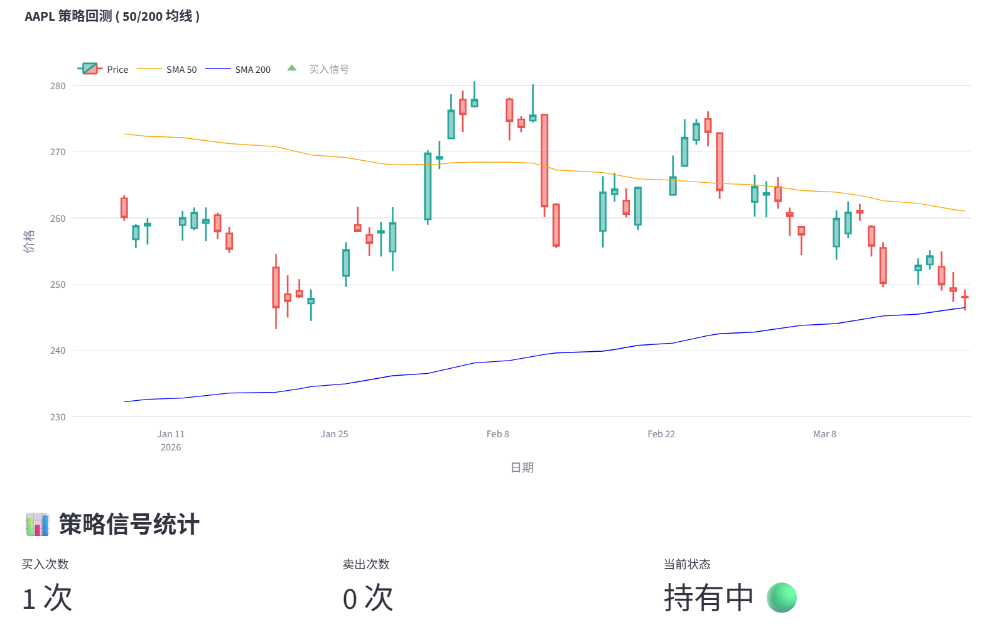

# 📈 Stock Viz Pro

> 一个基于 Python 的股票数据可视化与策略回测工具

[](https://www.python.org/downloads/)
[](LICENSE)
[](https://github.com/psf/black)
[](https://streamlit.io/)

---

## 🎯 项目简介

**Stock Viz Pro** 是一个面向量化交易初学者和数据分析师的可视化工具。它可以帮助你：

- 📊 **快速获取** 全球股票历史数据
- 📈 **可视化分析** K 线走势与技术指标
- 🧠 **策略回测** 均线交叉等经典交易策略
- 🚀 **零配置运行** 只需几行命令即可启动

---

## ✨ 功能特性

| 功能 | 描述 |
|------|------|
| 数据获取 | 支持 Yahoo Finance 全球股票数据 |
| K 线图表 | 交互式 Plotly 蜡烛图 |
| 技术指标 | 支持自定义周期均线 (SMA) |
| 交易信号 | 自动标记金叉/死叉买卖点 |
| 数据统计 | 实时计算最高价、最低价、收盘价 |

---

## 🖼️ 项目演示

### 主界面
### 策略信号


---

## 🚀 快速开始

### 前置要求

- Python 3.10+
- [uv](https://github.com/astral-sh/uv) (推荐) 或 pip

### 安装步骤

```bash
# 1. 克隆仓库
git clone https://github.com/glztl/stock-viz-pro.git
cd stock-viz-pro

# 2. 使用 uv 安装依赖 (推荐)
uv sync

# 或使用 pip
pip install -r requirements.txt

# 3. 运行应用
uv run streamlit run app.py
# 或
streamlit run app.py
```


## Star History

<a href="https://www.star-history.com/?repos=glztl%2Fstock-viz-pro&type=date&legend=top-left">
 <picture>
   <source media="(prefers-color-scheme: dark)" srcset="https://api.star-history.com/image?repos=glztl/stock-viz-pro&type=date&theme=dark&legend=top-left" />
   <source media="(prefers-color-scheme: light)" srcset="https://api.star-history.com/image?repos=glztl/stock-viz-pro&type=date&legend=top-left" />
   
 </picture>
</a>
